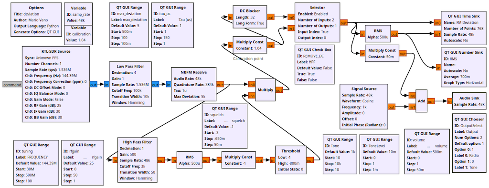
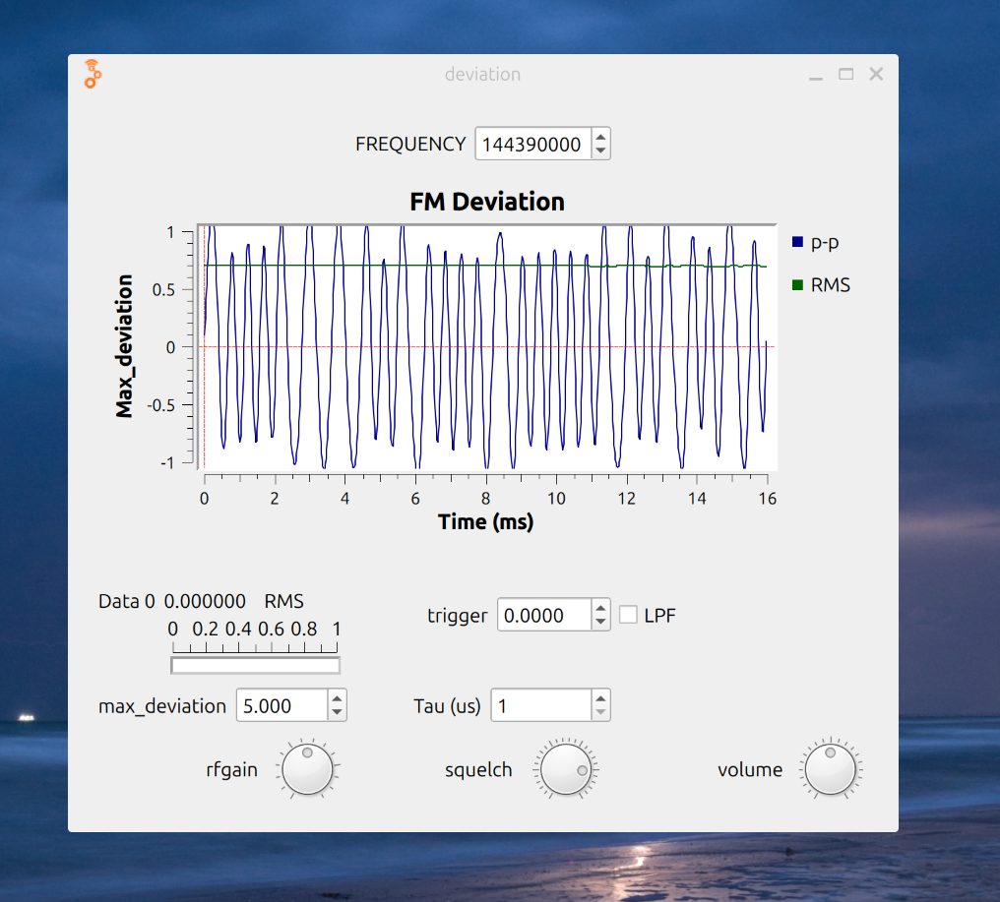

## FMDeviance 2.0: 8-Jan-2026

**_A Simple GnuRadio and RTL-SDR Based NBFM Deviation Meter_**

This is a complete rewrite of my original deviation meter to eliminate many earlier limitations caused by the use of Gnu Radio's built in NBFM Demodulator block. While that block works very well for building receivers, it does not expose some parameters needed for wideband use and accurate measurements, so I decided to use lower level blocks to create my own demodulator.

The only prerequisites are that you have a recent version of GnuRadio installed that includes the OsmoSDR support for SDR radios, and that you have a properly 
installed library for you RTL-SDR.com version 3 or 4 radio. On some platforms you need to install the OsmoSDR support as a separate step.

### Known Limitations

Although it allows you to set them, the present version does not properly handle audio bandwidths greater than 20 KHz.

### Tuning Control

There is a newer Gnu Radio Control called the "QT GUI Digital Number Control" that can be used to set the receiver frequency. If you'd like to try it, and if it shows up in your version of Gnu Radio and the block is not labeled as "missing", you can enable it and disable the "QT Range" control in the lower left corner of the flow diagram labeled "tuning". Both do the job, but the method of tuning is completely different in each of them.

### Display Controls

Hovering over the scope display will show the Y value of the peak deviation at that point.

While hovering over the scope display, the mouse wheel can be used to zoom the Y axis gain up or down. Of course, if you zoom out, what you see will not display much beyond the max_deviation and current bandwidth settings.

You can also select a rectangular portion of the display with the left button. When you release the button, the display will zoom to the selection.

Clicking with the right button will restore the original zoom settings.

The oscilloscope display runs free instead of being triggered. If you have a 3 button mouse, the middle button can pop up a menu of scope display parameters which can be used to modified this and other behaviours. You can also save the scope display as a jpeg file.

Wayland based systems may output lengthy warnings to standard output that X windows features used by this popup menu may not be supported in the future. These are annoying, but they may safely be ignored and don't affect operation at this time.

### Deviation in Khz

This sets the full scale value on the display and also sets the RF bandwidth needed to pass the relevant FM sidebands for that deviation.

### Audio Bandwidth in Hz

This sets the baseband filtering bandwidth. This is the highest received audio frequency that can be displayed. On startup, it defaults to 5 KHz which is a good setting for most NBFM communication use at 5 KHz deviation.

Note that for NBFM, this wider bandwidth will often result in a lot of "jagged" or "raspy" appearing signals because that is what the transmitter is sending. They're normally outside the passband of NBFM receivers. If you want to simulate a typical transceivers's receiver instead of measuring the total transmitted deviation, you can reduce this setting to 3500 Hz.

Wireless microphones and broadcast measurements require a much wider setting. The value you select will depend on the highest modulating frequency of interest. Many wideband devices send additional subcarrier information like pilot tones, ultrasonic squelch tones, stereo difference information, supplementary subcarrier broadcasts, and additional digital channels above the basic transmission.

If you want to measure the total deviation of these, you must use a high enough bandwidth to pass all of them; if you are only interested in observing the behavior of the basic analog channel, you can use a lower value to filter them out.

For most US FM broadcasts, the maximum deviation should be set to 75 KHz. You can set the bandwidth to 16 KHz to see just the basic Mono signal. To see the full composite signal including pilot tone, L-R, SCA and Digital subchannels, you will need to use a bandwidth setting of at least 60 KHz. Note that with bandwidth > 20 KHz, operation is incorrect with the present filter implementation.

### Tau

There is a selector that allows Deemphasis to be applied to the audio output. This is provided as a convenience for listening and roughly monitoring loudness. This filter only affects the monitor -- not the displayed deviation.

Note that the Tau applied if "WBFM" is chosen is the standard FCC value of 75 microseconds. Outside of North America, 50 microseconds is normally used. There is a variable called TAU in the flow graph where you can set this to any value desired.

The use of "NBFM" deemphasis is not specified by the FCC and varies widely in the industry. This filter applies a commonly used 750us value.

This may not be what you want as manufacturers use a variety of other demodulator response curves depending on their technology and desired speaker response! There is a variable called NBFM_TAU which can be used to adjust this value. 

### Removing DC

There is a checkbox that allows the application of a low pass filter to eliminate the DC component of the incoming signal. This DC offset is an indication of the difference in frequency between the Deviation meter and the incoming signal.

Being able to see the DC component is useful for detecting whether the transmitter is roughly on frequency or "chirping" during transmission, but in some cases it is desirable to reset the baseline to 0 for easier measurements. Note that this will also remove low frequencies below about 50 Hz. For maximum accuracy when measuring continuous tone squelch deviation, this option should NOT be selected.

### Tone Oscillator

A popup box in the lower right corner of the display allows you to select audio output from either an adjustable sine wave oscillator or from the monitor receiver. You may need to add a capacitor and/or transformer to your sound card output to get proper input to your transmitter's microphone circuit, as they often have DC bias voltage on them.

### Calibration

In the upper Left corner of the flow diagram, you will find a variable named "CALIBRATION". In theory, the correct setting for this should be 1.0 since all the demodulation is done digitally based on calculated ratios and should be accurate. If you find that checking against another deviation meter, or Bessel nulls disagrees with this, you can trim the reading by using this variable.

### Accuracy

Within the limits of the Low Pass filtering, the measured single sine wave deviation should be accurate within 3% of the measured value. Note, however that for wideband measurements, the scope display has some limitations above 12 Khz and some aliasing may be seen. The bandwidth filters specify the frequency at which the signal is significantly reduced, so the response typically begins to drop at about 90% of the set value.

The RMS value displayed is for use as a reference only.

### Debugging Display

There's a disabled "QT GUI sink" block included in the flow diagram used for debugging. For troubleshooting, it can be connected to inspect the signal anywhere. It takes a lot of screen space and CPU. When connected to the output of the RTL-SDR source, it has sufficient resolution to observe Bessel Nulls for calibration if appropriately zoomed. The first two nulls are at modulation indices of 2.4048 and 5.5200.

### Compatibility

This may work with other radios that have Gnu Radio support, but I've only tested it with the official RTL-SDR.com version 3 and 4 dongles.

I've only encountered one problem in moving FMDeviance between different platforms and versions of Gnu Radio. The various Low and High Pass Filter modules may report that they can't find the hamming windowing option because sometimes they have different suffixes for the option names in the popups. To fix this, open each complaining module and pop up the selector for the windowing option, then reselect the hamming window listed. This is easier than it sounds - the correct names are obvious variations of the incorrect ones.

### Disclaimers

I designed this experimental NBFM Deviation meter as an aid to operation and experimentation. It is not designed to be highly accurate or foolproof, or to be a high performance receiver. It works well when used as intended.

Be careful not to destroy your SDR receiver input by having the Radio and SDR antennas close together! HTs can produce quite high rf voltages in nearby equipment.

In some cases, you may need to use a power attenuator and/or sampling tap connecting the transmitter output and the SDR dongle to safely obtain a signal that is not leaking from earlier transmitter stages. 

This software was made possible thanks to the excellent work done by the Gnu Radio team and the rest of the community!

Mario Vano AE0GL

